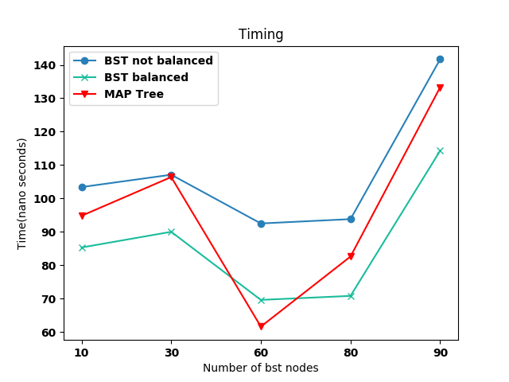

# BINARY SEARCH TREE

I was asked to implement a Binary search tree.

In the folder could be seen:

- Makefile (it is the makefile to create the main.x. (CXXFLAGS = -g -std=c++14 -Wall -Wextra -O3)
- bst.h: in this file all the binary search tree code is declared. 
- main.cpp: It is the code to implement the benchmarking.
- o2_main.cc: it is the part of the old main to control if the tree is correct when initialised.

To compile the code run the " make " command.

To have the valgrind analytics run "valgrind ./main.x" command. 

## Code parts

The binary search tree has two main classes: tree_node and bst. The first one is the tree node class and the second one is the binary tree class. There is a third class, the iterator class, but is implemented inside the bst class.  

The node of the tree, based on the class tree_node has 2 unique pointer to left and right possible members (initialised to null pointer when the node is created), one pointer to the parent one (that is a null pointer in the case of the first element of the tree (the root)),  and a pair of value (std::pair) in which are stored the key and the value associated to each node. The constructor are a default one, a custom one (that initialised the node from a pair and a pointer to the parent node), a copy constructor and a move constructor. 

```c++
template <typename key_type,typename value_type>
class tree_node
```


Inside the bst class is possible to see:

```c++
template <typename key_type,typename value_type,typename cmp=std::less<key_type> >
class bst
```


- the initialisation of the root

  ```c++
  std::unique_ptr<tree_node<key_type,value_type>> root;
  ```

- the inizialisation of the compare operator of type less(of type std::less<key_type> )

  ```c++
   cmp compar;
  ```

- a function vector_fill_mid to fill the vector to balance the tree (we copy all the key of the unbalanced tree in a vector, giving the central key the key root, then in a recursive way we fill thw vector from begin and from the mid point(we divided the vector in two parts to balance better th tree))

  ```c++
  void vector_fill_mid(std::vector<std::pair<const key_type, value_type>> v, int first, int last)
  ```

- default constructor

- implementation of cpy and move semantics

  ```c++
      //move semantic only for smart ptr
      bst(bst&& b) noexcept = default;
      bst& operator=(bst&& b) noexcept = default;
      //copy semantic
      bst(const bst& b) : root{}
      {
          if(b.root) root=std::make_unique<tree_node<key_type,value_type>>(b.root);
      }
      
      bst& operator=(const bst& b)
      {
          root.reset();
          auto temp{b};
          *this = std::move(temp);
          return *this;
      }
  ```

- alias and reference to iterator class

  ```c++
   template <typename O>
      class __iterator;
      
      //alias
      using iterator = __iterator<std::pair<const key_type,value_type>>;
      using const_iterator = __iterator<const std::pair<const key_type,value_type>>;
  ```

- end function

  ```c++
   iterator end()
   const_iterator end() const 
   const_iterator end() const 
  ```

  

- begin functions

  ```c++
       iterator begin() noexcept
       const_iterator begin() const
       const_iterator cbegin() const
  ```

- the find function:

  ```c++
  iterator find(const key_type& x)
  const_iterator find(const key_type x) const 
  ```

  

- the insert function: 

  ```c++
  std::pair<iterator,bool> insert (const std::pair<const key_type,value_type>& x)
   std::pair<iterator, bool> insert(std::pair<const key_type,value_type>&& x)
  ```

  

- emplace function (single implementation for both the r and l values)

  ```c++
  std::pair<iterator,bool> emplace(Types&&... args)
  ```

- subscripting operator

  ```c++
   value_type& operator[] (OP&& x)
  ```

- put to operator function:

  ```c++
  friend std::ostream& operator<<(std::ostream& os,const bst& x)
  ```

- clear function:

  ```c++
  void clear()
  ```

- balance function

  ```c++
  void balance()
  ```

- class operator:

  ```c++
  template <typename key_type, typename value_type, typename cmp>
  template <typename O>
  class bst<key_type,value_type,cmp>::__iterator
  ```


#######################

## Benchmark:

i benchmark the binary research tree using  10  30  60  80 90 nodes.

I have measured the time for the function find in a non balanced binary research tree, a balanced research tree and a tree constructed through the function std::map (is a sorted associative container that contains key-value pairs with unique keys).



It is possible to see that the fastest find function is the one associated to the binary research tree after the balance operation, this function generally behaves better then the one associated to the Map tree. The lowest performance are related to the BST not balanced. We expected a logN behaviour bu the curves, but this was not seen in my graph, only in the right part of it. Another problem was the number of nodes to be created. I can't go further in the number of node created because it was not possible (it takes to much time).  I Think this problem is related to the implementation of the tree coupled to a memory problem, but at the moment I don't have any idea why this is happening.

## end stuff

Using the -Wall -Wextra and Valgrind i don't receive warning and error due to memory leaks 

(HEAP SUMMARY:
==9504==     in use at exit: 0 bytes in 0 blocks
==9504==   total heap usage: 2 allocs, 2 frees, 73,728 bytes allocated
==9504== 
==9504== All heap blocks were freed -- no leaks are possible)

The only error I have is:

Invalid read of size 1
==9504==    at 0x4BFB6CA: ____strtol_l_internal (in /usr/lib64/libc-2.29.so)
==9504==    by 0x401BF1: atoi (stdlib.h:363)
==9504==    by 0x401BF1: main (main.cpp:17)
==9504==  Address 0x0 is not stack'd, malloc'd or (recently) free'd
==9504== 
==9504== 
==9504== Process terminating with default action of signal 11 (SIGSEGV): dumping core
==9504==  Access not within mapped region at address 0x0
==9504==    at 0x4BFB6CA: ____strtol_l_internal (in /usr/lib64/libc-2.29.so)
==9504==    by 0x401BF1: atoi (stdlib.h:363)
==9504==    by 0x401BF1: main (main.cpp:17)
==9504==  If you believe this happened as a result of a stack

but I am still searching how to fix it.